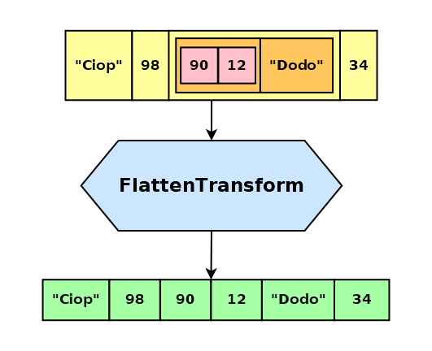

# flatten-transform

_Modern, configurable flattening stream_


[](https://badge.fury.io/js/@giancosta86%2Fflatten-transform)
[](/LICENSE)



**flatten-transform** provides a `FlattenTransform` stream for NodeJS, flattening _arrays_ and _other iterables_ into a _linear sequence_ of items - although the client can optionally set a _maximum nesting level_ so as to constrain the _recursive algorithm_.

Like any other standard `Transform` object, the stream can be plugged into a pipeline, as well as manually controlled.

## Installation

```bash
npm install @giancosta86/flatten-transform
```

or

```bash
yarn add @giancosta86/flatten-transform
```

The public API entirely resides in the root package index, so you shouldn't reference specific modules.

## Usage

Just create a new instance of `FlattenTransform` and use it in a pipeline, or call its standard methods like `.write()` `.end()`, `.on()`, ...

### Example

This somehow contrived example still shows the simplicity of `FlattenTransform` as well as its support for _pipelines_ and _events_ - among the various stream features.

```typescript
export async function recursiveFlatten(
  source: Iterable<unknown>
): Promise<unknown[]> {
  const linearResult: unknown[] = [];

  const flattenTransform = new FlattenTransform().on("data", item =>
    linearResult.push(item)
  );

  await pipeline(Readable.from(source), flattenTransform);

  return Promise.resolve(linearResult);
}
```

### Constructor parameters

- **maxNestingLevel**: a limit to the recursion performed by the flattening algorithm. The default value is `Infinity` - meaning that _each and every iterable will be recursively flattened_; in contrast, the minimum allowed value - `0` - will actually disable flattening, converting `FlattenTransform` to a pass-through stream

- **highWaterMark**: if present, passed to the base constructor

- **signal**: if present, passed to the base constructor

## Further reference

For additional examples, please consult the unit tests in the source code repository.
